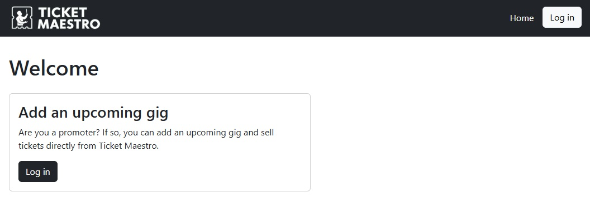

# Assignment 3

## Website URL
https://ticket-maestro.onrender.com/

## Github Repo
https://github.com/shielsr/assignment-03

## Full Documentation
[View full documentation](documentation.md)

## Project goal
The goal of the project is, firstly, to allow event promoters to sell tickets for their live event, and secondly for customers to purchase tickets for those events.

## Features
### As an event promoter, the user can:
- Create new events
- Schedule when tickets go on sale for an event
- Change their account settings in /my-account
- Log in and out of sessions

### As a customer, the user can:
- See when tickets will go on sale
- Buy tickets for events when the sale goes live
- Manually refresh the number of tickets left for an event
- Get error feedback when trying to buy too many tickets
- Get feedback when there aren't enough tickets left

 
 

# Instructions on how to use the site

 

## Deploy to Render.com
Take the standard Render.com steps:
1. Register on render.com and connect your GitHub Account
2. Commit & sync files to GitHub
3. In Render, set up a new "Web Service"
4. Under Settings: Keep the build command as `pip install -r requirements.txt` and set the start command to `gunicorn app:app`
4. Under Environment: Set the value for SECRET_KEY to a random value

 

## Navbar
The navbar changes on deskotp and mobile devices. On desktop, it's a simple navbar, but on mobile it changes to a hamburger menu.

The contents of the navbar change depending on whether the user is logged in or not. Log in to see the full set of links.

 

## The event grid on desktop
Events are displayed in a 3-column Bootstrap grid. As new events are added, they appear here in their ID order.

 

## The event carousel on mobile
On mobile, the event grid is replaced with a carousel. The entire cards are clickable (as opposed to on desktop where only the button was clickable). Users can swipe through the carousel.

 

## Logging in
Users can log in to their accounts at /login-page. For the purposes of this assignment, you only need to enter a name to log in (i.e. there are not passwords etc). 

Once logged in, the navbar is now populated with the full suite of options, namely the 'Add event' and 'My account' buttons.

On the homepage, the welcome message now includes the user's name (e.g. 'Welcome, John!'). The 'Add an upcoming gig' card has also changed, with the 'Log in' button replaced by an 'Add a new gig' button.

 

## Adding a new event
As an event promoter, add a new event by filling out the form. The promotion company name is filled in based on the logged-in user (more on this later). The form has full Javascript validation.  Please note: To create an event & start selling tickets immediately, set the 'Start of sale' date to a day prior to today.

 

## Buying tickets
As a customer, I can buy tickets for upcoming events. The sale start date must have passed in order for the order form to become available (in the pre-createad example, the Taylor Swift ticket sale hasn't begun yet)

Once the sale has begun, the order form appears. If the user is logged in, their name will appear. If not, they have to enter their name. 
There is additional validation on the 'Number of tickets' field. In addition to a cap of 50 tickets, it also checks how many tickets are left. 

 

## 'Refresh tickets' button on the '/buy' page
In a real-life scenario, multiple people will try to buy tickets at the same time. Here, users can press the 'Refresh tickets' button to see if the 'tickets left' variable has changed since they loaded the page. You can recreate this scenario by opening up the site in two tabs, one of them incognito. Order tickets in the incognito tab, then in the other tab press 'Refresh tickets'. You'll see the number change.

 

## My account
When logged in, users have a basic 'My account' page. There, users working for promotion companies can change the name of the promoter they work for. This update is in turn used whenever they create new events.

