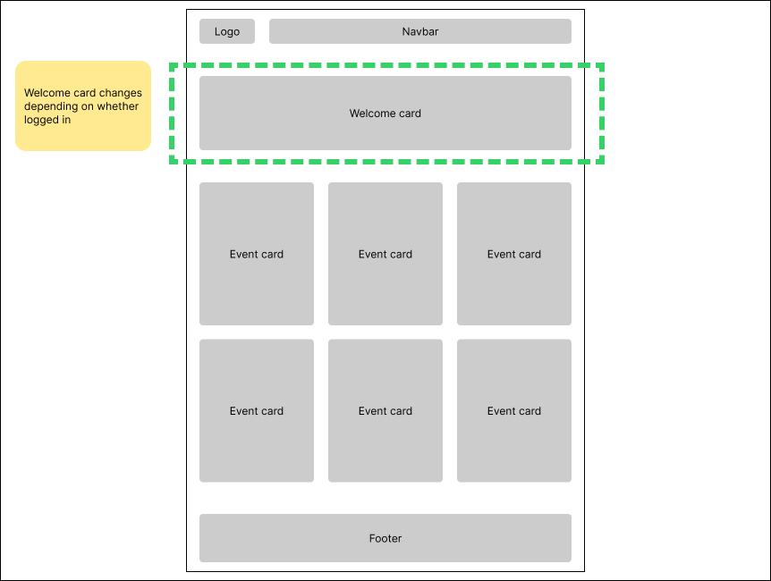
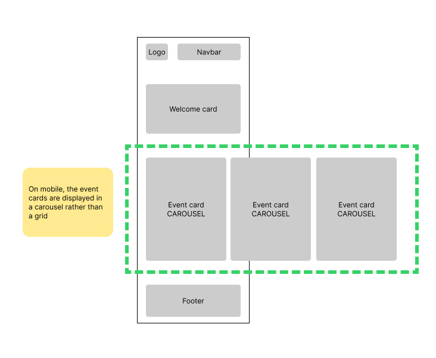
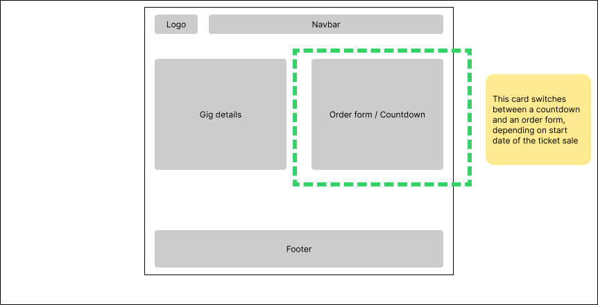
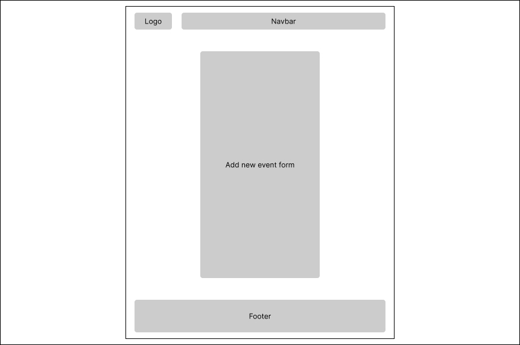
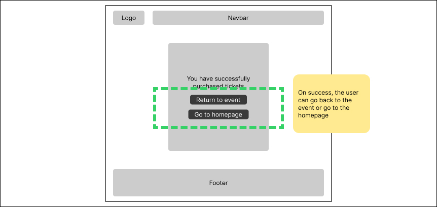
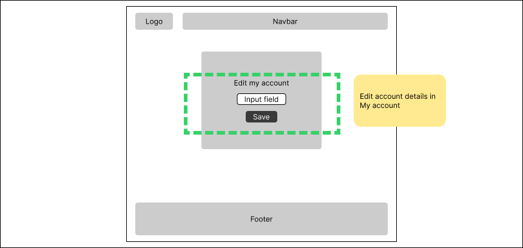
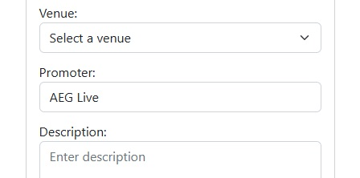

# My design decisions
## User stories

### Roles:
- Event promoter who wants to sell tickets
- Customer who wants to buy tickets

 

### Event promoter user stories:

#### 1. Create new gig events
[MUST] As a promoter, I want to post upcoming gigs with details on artist, time, date, and venue, so fans will know what gigs are coming up.

#### 2. Create ticket sale events
[MUST] As a promoter, I want to create a ticket sale event with start date, start time, amount of tickets, so I can sell tickets and make money.

#### 3. Countdown to sale start
[MUST] As a promoter, I don't want to sell tickets before the sale start date, so fans can be ready to buy at a specific time.

#### 4. Measure ticket amount
[MUST] As a promoter, I want to stop selling tickets when they run out, so I don't sell too many tickets.

 

### Customer user stories:

#### 1. Countdown to sale start
[MUST] As a customer, I want to see when the ticket sale begins so I can be ready at a specific date and time.

#### 2. Purchase tickets
[MUST] As a customer, I want to buy tickets so I can attend gigs.

#### 3. See ticket price
[MUST] As a customer, I want to see the final ticket price, so I know how much I will be paying.

 

### Future work:
I did not cater for the following user stories in this version of the website, as they are beyond the scope of the assignment.

#### 1. Record details of sale
[SHOULD] As a promoter, I want to see who has bought how many tickets, so I can send the correct amount of tickets to the right person.  [NOTE: I created a dict that captures this, but I currently don't surface it anywhere. Ideally it would go in /my-account]

#### 2. Artist search
[SHOULD] As a customer, I want to search for artists I like, to see when and where their next gigs are.

#### 3. 'My events' list
[SHOULD] As a promoter, I want to see a list of the events I've created, so I can keep track of my events.

#### 4. Edit my events
[SHOULD] As a promoter, I want to be able to edit events I've created, so I can fix typos or adjust event details.

#### 5. Customer accounts
[SHOULD] As a customer, I want to log in and see what tickets I've bought, so I can keep track of my purchases. [NOTE: I created a `Customer` class and would use it for creating customer (i.e. non-promoter) accounts]

#### 6. Image upload
[SHOULD] As a promoter, I want to upload images of my artists, so I can add relevant images when creating new events.

#### 7. Events in different time zones
[SHOULD] As a promoter, I want to add events in different time zones, so I can operate in different countries.

 
 

## Content
The site will include:
- Homepage showing available gigs
- 'Login' page to allow users to start sessions
- 'Add an event' page with a form for promoters to fill out
- 'Buy' page with a form for purchasing tickets
- 'Purchased' page to show that the order has been placed
- 'My account' page where logged-in users can edit their details

 
 

## Prioritised tasks:
1. Write classes and functions in Python to facilitate the user stories
2. Use Flask to set up templates, routes, etc
3. Use a combination of CSS and Bootstrap for the style and layout of the site
4. Use Jinja and Javascript for the functionality of the site
5. Deploy the app to Render.com

 
 

## Wireframes

I created basic wireframes in Figma for mobile and desktop, with the mobile layout responsively catering for tablets too.

### Homepage
The homepage shows a welcome card that changes depending on whether the user is logged in or not.

The event card grid changes to a carousel on mobile.

  

### Buy page
User can buy tickets. Order form is only visible after the sale start date and time has passed. Otherwise, they'll see a countdown timer.

### Add page
Logged-in promoters can add a new event via a form.

### Purchased page
Final /purchased screen showing order details and buttons going back to the event or on to the homepage.

### Edit my account
Logged-in users (e.g. the promoter) can edit their details on My account page.

 
 

# My development process
## How I went about it

The following is a step-by-step account of how I did the project, which closely corresponds with the series of commits I made to the repo.

- Brainstormed initial ideas for the assignment
- Wrote user stories and entities
- Created models.py file with some basic classes
- Created sandbox.ipynb to start experimenting with my classes
- Fleshed out the `Promoter`, `Gig` and `Sale` classes
- Wrote functions e.g. `countdown` to switch the sale on at a certain date and off when tickets run out
- Wrote functions for the buyer (`buy`), and for counting how many tickets are left
- Created `order_list` to store who buys tickets and the amount of tickets (Note: This works, but I ultimately didn't surface it in the HTML as it was beyond the scope of the assignment)
- Set up Flask. Created the app.py file and template html files
- Started surfacing the placeholder gig & sale data from Python into the HTML using Jinja
- Used a Jinja loop to show the placeholder gigs on the homepage in Bootstrap cards
- Displayed the cards in a 3-column Bootstrap grid
- Set up the /buy page to allow users to purchase tickets (i.e. reduce the `tickets_left` amount)
- Added basic login session functionality
- Allowed users to add new gigs, which appear in the loop on the homepage
- Every new `gig` & `sale` event has its own /buy page, with the event ID added to the URL
- To demonstrate understanding of Javascript, I added a carousel to the mobile homepage, adapting code from [this Medium article](https://medium.com/@pietrogon/how-to-create-a-carousel-with-html-css-and-javascript-step-by-step-guide-f46c267692d2)
- Included a Bootstrap navbar for desktop and mobile menus. Followed the documentation here: https://getbootstrap.com/docs/4.0/components/navbar/
- Again to demonstrate understanding of Javascript, I worked with Rob Cleary to fetch the `tickets_left` amount and update that on the /buy page when the user clicks the 'Refresh tickets' button. 
- Added logic to the homepage's 'Add a new gig' card so that the user must first log in before they can add a gig
- Developed the login section further, adding a dict with promoter details, which can be edited on a 'My account' page (I followed Yoni's lesson here)
- Used Javascript to do error checking on form inputs for both the /buy and /add pages
- Used flex and grid in CSS to finalise the layout
- Added favicon and logo (generated by AI)
- Did a final tidy-up of my code and completed the documentation.

 
 

# Challenges faced

Challenges I faced include:

 

## Incorporating Javascript
I found that Python/Flask/Jinja could do a lot of things that I would have previously done in JS, so I had to come up with different ways of incorporating JS. I used it in 4 main places:
1. The mobile carousel on the homepage
2. The 'Refresh tickets' button on the /buy page
3. Form validaiton on the /buy and /add pages
4. Countdown timer on the /buy page (see [Countdown timer](#countdown-timer) below)

The 'Refresh tickets' button warrants more explanation. I worked with Rob Cleary on using Javascript to fetch the number of tickets left from the server. 
The concept behind it was: During a real-world ticket sale, multiple users will buy tickets at the same time. So, it's possible that tickets will run out before a user can complete their order. The 'Refresh tickets' button reflects this scenario. You can test it out by opening the site in 2 browsers, buying tickets in one, then pressing 'Refresh tickets' in the other browser to see the 'tickets left' number decreasing.

 

## Styling with Bootstrap and CSS
I hadn't used Bootstrap before so there was a learning curve here. I used  Bootstrap for some of the core components (e.g. the navbar, cards and the homepage card grid). I used CSS for the broader layout, using `grid` and `flex`. I also used CSS media queries to show/hide the carousel on mobile, and to add hover effects to the gig cards on desktop. 

 

## Passing data between Python, Flask, Jinja and Javascript.
The biggest challenge for me was figuring out how to pass data between Python, Flask, Jinja and Javascript. In particular, it took me a while to figure out how to pass the `gig_id` around, as that ID was essential to tying the /add, /buy and /purchased pages together. The `tickets_left` variable was also a challenge, as I needed to use it in Javascript too (see 'Incorporating Javascript' above).

 

## Working with images
I considered allowing promoters to upload images when they're adding gigs, but I felt this was beyond the scope of the assignment. Instead, I uploaded some .jpgs to static/images and included a select dropdown in the form on the /add page. 
I also had trouble calling the image locations for the `img src`. I eventually figured out how to do absolute urls with Jinja instead of relative ones.

 

## Working with sale start dates
My goal was to only show the 'Buy now' form on the /buy page once the sale start date (`sale_date_time`) is reached. 
It took a while to figure out how to do this. I eventually figured out I needed to change the inputted date string into a `datetime` object, then doing the maths with `datetime.now()`. 

### Countdown timer
The countdown was trickier. I wanted to show a countdown timer on the /buy page.  I initially did it based on the day (i.e. the buy form appeared at midnight), but this didn't allow for a sale starting at, say, 9.30am (which, in a real-world scenario, would be the case).  I then switched from days to seconds in my `countdown()` method. I also wanted to make it readable to the user in days, hours, mins, seconds. I initially did this in Jinja, but then realised it would be better to do it in Javascript. 

Note: The Render.com server operates in UTC rather than Ireland's UTC+1, so for now the deployed app is one hour behind Irish time.

 

## Sessions and accounts
I followed Yoni's lessons on creating sessions, logging in, and editing account details. I put a dict in a dict for `user_datastore`, because I wanted to add more data for each user. In the end, I only set up one key (`'promoter'`) but if developing it further I would add additional keys like email, DOB, etc.  

### Changing account settings and showing these updates site-wide

I wanted to create a /my-account page. It took me a while to get the hang of pulling the data in via Jinja but I eventually got it. I allowed the user to update their `promoter`. I went one step further and, on the /add page (where users add new events) I pulled the `promoter` value into the Promoter text input field. When the user changes their `promoter` in their account, the change is reflect in the /add page too. 

 

## Bugfixes
I fixed bugs as they came up. I also had a few friends doing user testing, and fixed anything they spotted.